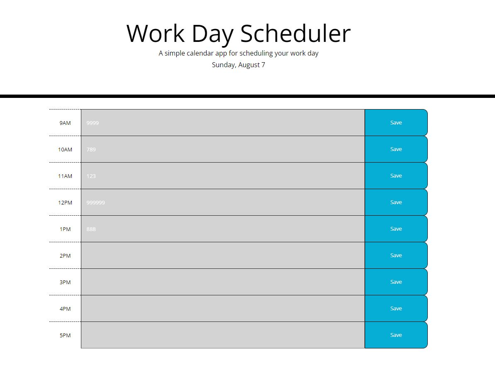

# Challenge5
This is the project for week5. It contains jQuery practice. First functional draft done 8/5/2022. Final draft 8/7/2022. 

## Project Description
In this project, I created a calendar with list to do function from given starter code. 

## Difficulties Encountered
1. We learned so many syntax for the past few lectures and I was a bit confused
2. When rendering past input contents, I wasn't able to store it in the local storage (fixed)
3. Cannot distinguish between data types (when to stringify/JSON/what JQuery returns, etc). Looking for more resources.

## Project Ourcome Overview

[Visit my Quiz Page Here](https://aurorayihe.github.io/Challenge4/)